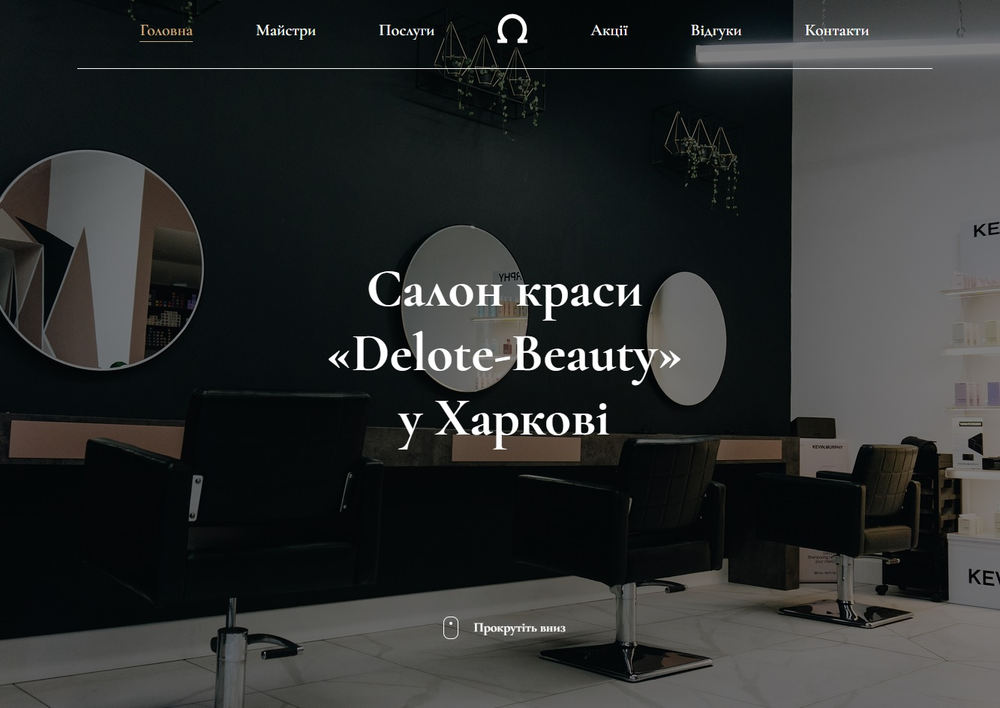

# Delote Beauty

## Description

It's a modern lending site for an interior design studio, developed using NextJS and TypeScript. The project uses SCSS for modular styles, which provides easy support and clean code.

The site is fully adaptive, displaying correctly on all devices - from cell phones to desktops. Thanks to smooth animations and transitions, the interface looks dynamic and attractive.

The project is optimized for fast loading and provides a smooth user experience.

## Technologies that have been used

- HTML5
- CSS3
- SCSS
- JAVASCRIPT (ES6+)
- TYPESCRIPT
- NEXT JS
- GIT
- VITE

## Instructions for working with the project

1. Cloning a repository. You need to write `git clone https://github.com/boikoua/delote-beauty` in terminal.

2. Go to the project folder `cd delote-beauty`.

3. Check the node version. The version of node should be `v20.x.x`. To do this, type the command `node -v` in the terminal.

4. Install dependencies. To do this, enter the `npm install` command.

5. Run the project. To do this, enter the `npm run dev` command.
   After that the project will be available to you at `http://http://localhost:3000/`.

## View project

> Link to the project
> [DEMO LINK](https://delote-beauty-kappa.vercel.app/).

## Preview

